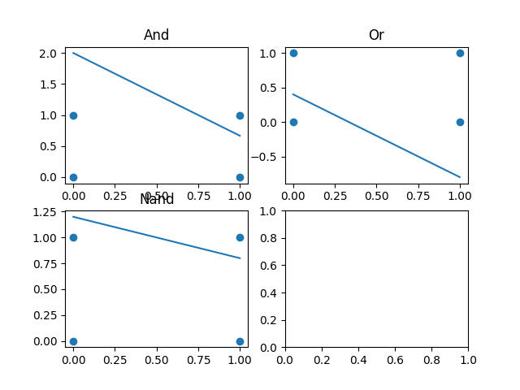

# Machine Learning Code
It is just my machine learning code in fortran, for the moment I only have programmed a perceptron :).
# To compile
You need to install [assertf](https://github.com/alecksandr26/assert-fortran/blob/main/README.md) and after that run.
```
make
```
# Examples
## Example perceptron
An example of the linearly in some logic gates.



This is a graphical representation of the perceptrons weights, the perceptron try to classify rectangles and circles.


